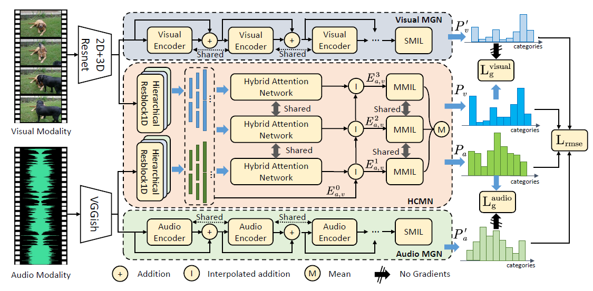
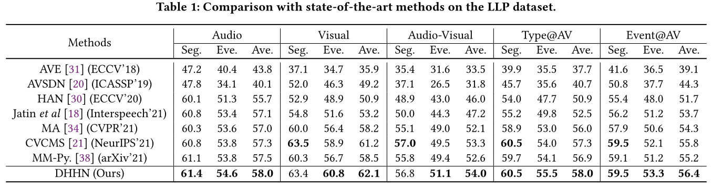
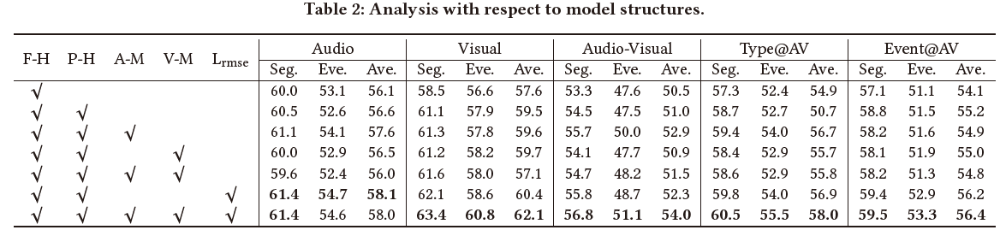
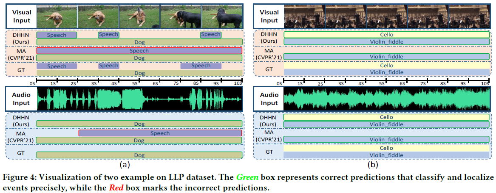
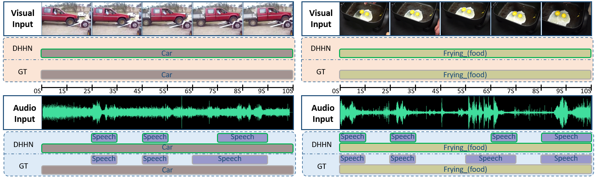

# Introduction

This is the implementation codes and instruction of the proposed work DHHN.



## Main Idea

The Weakly-Supervised Audio-Visual Video Parsing (AVVP) task aims to parse a video into temporal segments and predict their event categories in terms of modalities, labeling them as either audible, visible, or both. Since the temporal boundaries and modalities annotations are not provided, only video-level event labels are available, this task is more challenging than conventional video understanding tasks. Most previous works attempt to analyze videos by jointly modeling the audio and video data and then learning information from the segment-level features with fixed lengths. However, such a design exist two defects: 1) The various semantic information hidden in temporal lengths is neglected, which may lead the models to learn incorrect information; 2) Due to the joint context modeling, the unique features of different modalities are not fully explored. To tackle these problems, we propose a novel AVVP framework termed Dual Hierarchical Hybrid Network (DHHN) to tackle the above two problems. 

## Insight of Our Work

1. We propose a Hierarchical Context Modeling Network (HCMN) which extracts contexts from multiple scales to avoid the misunderstanding caused by incomplete event fragments. It can significantly improve the performance of video parsing on event-level localization. 
2. We design a Modality-wise Guiding Network (MGN) assisting model to learn characteristic intra-modality features, which is essential for discriminating modality categories in the AVVP task.
3. Based on the kernel module Hierarchical Hybrid Network (HHN), which is built on HCMN and MGN, we design a dual-stream model Dual HHN. By adapting audio and visual modalities with two different HHNs respectively, we furtherly boost the performance of video parsing.
4. We evaluate our model on the benchmarks LLP and the results show that our DHHN method outperforms recent state-of-the-art methods. Especially, we achieve promising improvement in the performance of event-level localization.

# Experiments

## Environment Requirements

Our code runs based on the following dependencies mainly:

- python3
- torch
- numpy
- pickle
- argparse
- ...

## Features Preparation

Please refer to https://github.com/YapengTian/AVVP-ECCV20 for downloading the LLP Dataset and the preprocessed audio and visual features. Put the downloaded r2plus1d_18, res152, vggish features into the feats folder.

## Running

You can train and test our model by runing the shells we provided.

With Label Refinement:
```Bash
sh DHHN_refinement.sh
```

Without Label Refinement:
```Python
sh DHHN_origin.sh
```

# Overall Results

## Performance on the LLP dataset



## Ablation studies



## Visualization Results




For more qualitative analysis, please kindly refer to our supplementary materials.



We sincerely thank the following works for their codes:

```ref
@inproceedings{wu2021explore,
    title = {Exploring Heterogeneous Clues for Weakly-Supervised Audio-Visual Video Parsing}, 
    author = {Wu, Yu and Yang, Yi},
    booktitle = {Proceedings of the IEEE Conference on Compute Vision and Pattern Recognition (CVPR)}, 
    year = {2021}
}

@inproceedings{tian2020avvp,
  title={Unified Multisensory Perception: Weakly-Supervised Audio-Visual Video Parsing},
  author={Tian, Yapeng and Li, Dingzeyu and Xu, Chenliang},
  booktitle = {ECCV},
  year = {2020}
}
```
